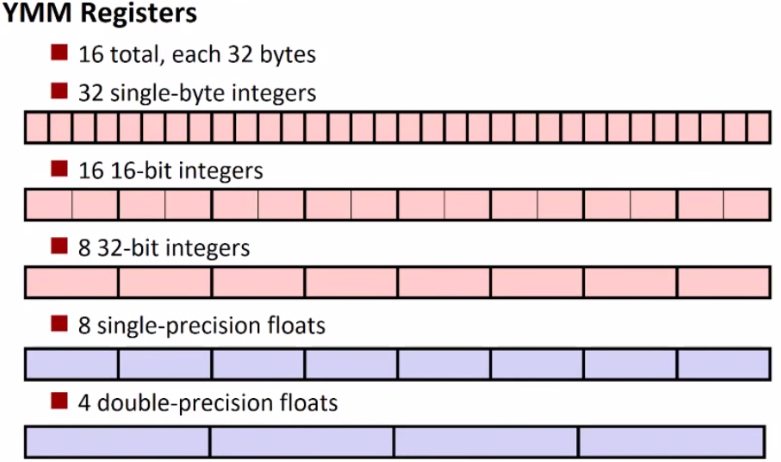

# Lab 8 - AVX



The [advanced vector extensions](https://en.wikipedia.org/wiki/Advanced_Vector_Extensions) (AVX) are an instruction set for Intel (and AMD) machines that help us utilize the parallel processing(at the instruction level) capabilities of our modern [superscalar processor](https://en.wikipedia.org/wiki/Superscalar_processor). Today we are going to get some practice using them! 

## Motivation

Put quite simply, a superscalar processor allows us to take what we have previously learned with pipelining and now fetch, decode, and execute more than 1 instruction at a time. The image below(from wikipedia) shows an example. In your instructors most humble opinion...this is awesome!


> Simple superscalar pipeline. By fetching and dispatching two instructions at a time, a maximum of two instructions per cycle can be completed. (IF = Instruction Fetch, ID = Instruction Decode, EX = Execute, MEM = Memory access, WB = Register write back, i = Instruction number, t = Clock cycle [i.e., time])

**Alright--let's start learning!**

## Part 1 - Intrinsics (Background reading)

Intrinsics are built-in functions within a compiler. They appear as functions, and when used within a programming language, generate the appropriate assembly. Typically instrinics, or intrinsic functions, are provided to give some sort of specific optimization within a language.

The instrinsic functions for our compiler (either gcc or clang) are located in a header file named immintrin.h:

 ```c
 #include <immintrin.h> // Brings in the AVX Intrinsics
 ```

Navigating to `/lib/gcc/x86_64-redhat-linux/4.8.5/include/immintrin.h` you can actually see the contents of this file and where various intrinsic functions live.

For AVX2 specifically, you will see:
```c
#ifdef __AVX2__
#include <avx2intrin.h>
#endif
```
You may further navigate to `<avx2intrin.h>` and investigate the contents. Note, you will see within this header a message about whether or not it is okay to directly include <avx2intrin.h>. :)

## Part 2 - AVX2 Pratice

Now that you are familiar with where intrinsic instructions live, begin working through the following exercises:

* avx1.c - Uncover the basics of packing bytes into an instruction
* avx2.c - Build a print debugging function and learn about alignment.
* avx3.c - Arithmetic operations
* avx4.c - Understand masks
* avx5.c - Permuting and rearranging data with masks

For each example, you will compile the code using: (e.g. for avx1.c, `clang -std=c11 -mavx2 avx1.c -S -o avx1prog.S`) *Note the -mavx2 library*

## Part 3 - AVX2 Exercises

By now you have had practice with the AVX2 instructions. Now attempt the following two exercises: ex1.c and ex2.c 

## Lab Deliverable

1. Complete the exercises in Part 2: answering the questions and filling out the source files, avx[1-5].c.
2. Complete ex1.c
3. Complete ex2.c

## More Resources to Help

* Practical SIMD Programming: http://www.cs.uu.nl/docs/vakken/magr/2017-2018/files/SIMD%20Tutorial.pdf
* Intel Intrinsics guide: https://software.intel.com/sites/landingpage/IntrinsicsGuide/

## Going Further

- Perf is a profiler that can return information about the performance of your program. Measuring the performance of your system is the only true way to know if code changes and optimizations are making a difference. Run through the following commands to get an introduction to perf.
  - http://www.brendangregg.com/perf.html#OneLiners
